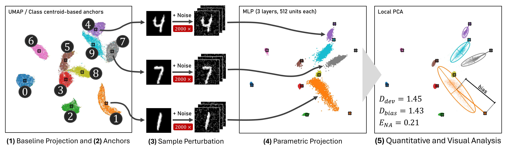

# **Stability of Parametric Projections under Input Perturbations**

[](https://opensource.org/licenses/MIT)
[](https://www.python.org/)
[](https://docs.python.org/3/library/venv.html)
[](http://arxiv.org/abs/2604.21617)
[](https://osf.io/t7uc3)

📄 **Paper:** [Paper](https://frederikdennig.com/publications/Dennig2026Instability)

## Overview



*UMAP projection of MNIST (a); class centroid-based points serve as anchors in all plots. Gaussian noise (σ = 0.17) is applied to anchor images (2000 samples); ellipses show local PCA directions and noise-induced bias after parametric projection (b–d). Unregularized MLPs (b: 3 layers, 512 units each; c: 6 layers, 1024 units each) yield large ellipses and high bias, with noisy samples drifting from anchors. MLP-small+J (d: 6 layers, 1024 units each, Jacobian regularization) produces small ellipses, low bias, and stable projections.*

## Key Features

* Compares parametric projection methods (neural networks) [1] against non-parametric baselines (UMAP [2], t-SNE [3]) for dimensionality reduction.
* Measures projection stability under Gaussian input perturbations using novel metrics ($D_{\text{dev}}$, $D_{\text{bias}}$, $E_{\text{NA}}$).
* Evaluates projection quality via trustworthiness and continuity [4] metrics.
* Includes MLP and spectrally-normalized MLP (SpecMLP) architectures with optional Jacobian regularization.
* Provides multiple visualization types: scatter plots, KDE contours, local PCA ellipses, anchor lines, and Voronoi tessellations.

## Requirements

* **Python** >= 3.11 ([Python 3.11.x](https://www.python.org/downloads/release/python-3110/))
* **Virtual environment**: [venv](https://docs.python.org/3/library/venv.html)

## How to Run

### 1. Setup Environment

```bash
# Create a virtual environment
python3 -m venv .venv

# Activate the environment
source .venv/bin/activate

# Install dependencies
pip install -r requirements.txt
```

### 2. Run Experiments

```bash
# Run full experiment pipeline
python3 main.py
```

This will:
- Load datasets (MNIST, FashionMNIST, Blobs, HAR)
- Fit UMAP [2] and t-SNE [3] projections
- Train neural network models to mimic projections
- Compute stability and quality metrics
- Generate visualization outputs

Results are written to `output/results/` as one CSV per model configuration (see
[Results](#results)). Note that `main.py` overwrites every CSV in that directory.

### 3. Generate Tables

The LaTeX tables in the paper are generated from the committed CSVs in `output/results/`:

```bash
python3 tables/create_main_table.py         # 00-comparison-table.tex
python3 tables/aggregate_lambda_sweep.py    # 00-lambda-tables.tex
python3 tables/aggregate_training_time.py   # 00-training-time-table.tex
python3 tables/aggregate_tsne_comparison.py # 00-tsne-table.tex
```

Each writes its `.tex` file into `tables/`. These outputs are gitignored.

### 4. Smoke Test

```bash
# Verify installation with a quick test
python3 test.py
```

### 5. Development

```bash
pip install -r requirements-dev.txt

./lint.sh check   # check linting and formatting (CI mode, no changes)
./lint.sh fix     # auto-fix with ruff, black, isort
```

## Results

`output/results/` contains committed **outputs** of `main.py` — the exact data behind the
paper's tables — and serves as the **input** to the scripts in `tables/`. Regenerating them
requires a full `main.py` run.

| File Pattern                       | Description                                                                 |
| ---------------------------------- | --------------------------------------------------------------------------- |
| `nn_<arch>_h<hidden>_n<layers>_{nojac,jac<λ>}.csv` | One file per entry in `MODELS` (`main.py`), 17 in total. Each holds 80 rows: 10 seeds (777–786) × 4 datasets × 2 projections. |
| `proj_umap.csv`                    | Non-parametric UMAP [2] baseline, same schema. Only UMAP appears here, as t-SNE [3] provides no `transform` and is therefore not evaluated on unseen noisy points. |
| `proj_umap_large_sweep.csv`        | UMAP [2] baseline from the follow-up run that added the MLP-large λ sweep. Retained for provenance; not read by any script. |

All files share one schema: `dataset`, `projection`, `run_id`, `run` (seed), `test_loss`,
`trust_p2`, `cont_p2`, `trust`, `cont`, `fit_time`, `inference_time`, `D_dev`, `D_bias`, `E_NA`.
The filename — not a column — identifies the model configuration. `test_loss` and `fit_time` are
`N/A` for the non-parametric baselines.

## File Overview

| File Name           | Description                                                                 |
| ------------------- | --------------------------------------------------------------------------- |
| `main.py`           | Main experiment pipeline: datasets, projections, models, metrics.           |
| `typedefs.py`       | Configuration namedtuples for datasets, projections, models, experiments.   |
| `models.py`         | MLP and SpecMLP neural network architectures.                               |
| `measures.py`       | Stability metrics ($D_{\text{dev}}$, $D_{\text{bias}}$, $E_{\text{NA}}$) and quality metrics. |
| `train.py`          | Training loop for projection-mimicking neural networks.                     |
| `utils.py`          | Utility functions (seeding, centroid selection, plotting).                  |
| `test.py`           | Smoke test for verifying installation.                                      |
| `distance_calibration.py` | Calibrates perturbation noise (sigma) across datasets using percentile-based matching to MNIST. |
| `noisy_mnist.py`    | Standalone figure: MNIST digits at increasing noise levels ($\sigma \in \{0, 0.17, 0.34\}$). |
| `lint.sh`           | Code quality checks and formatting (ruff, black, isort).                    |
| `dataset_loaders/`  | Dataset loading functions for MNIST, FashionMNIST, HAR, Blobs.              |
| `projection_utils/` | UMAP [2] and t-SNE [3] setup utilities.                                             |
| `plotting/`         | Visualization modules (scatter, KDE, PCA ellipses, Voronoi, anchor lines).  |
| `tables/`           | Aggregation scripts turning `output/results/` CSVs into the paper's LaTeX tables. |
| `output/results/`   | Committed experiment results — outputs of `main.py`, inputs to `tables/`.    |

## Metrics

### Stability Metrics

Given anchor point $z_0$ and $N$ noisy projections $\{z_i\}_{i=1}^N$:

- **$D_{\text{dev}}$** — Mean displacement: $D_{\text{dev}} = \frac{1}{N} \sum_{i=1}^{N} \lVert z_i - z_0 \rVert$

- **$D_{\text{bias}}$** — Displacement bias: $D_{\text{bias}} = \lVert \overline{z} - z_0 \rVert$ with $\overline{z} = \frac{1}{N}\sum_{i=1}^{N} z_i$

- **$E_{\text{NA}}$** — Nearest-Anchor Assignment Error: Fraction of noisy projections assigned to wrong anchor via nearest-neighbor.

### Quality Metrics

- **Trustworthiness** [4]: Penalizes false neighbors (points close in low-dim but distant in high-dim)
- **Continuity** [4]: Penalizes missing neighbors (points close in high-dim but distant in low-dim)

## References

[1] Espadoto, M., Hirata, N. S. T., & Telea, A. C. (2020). Deep learning multidimensional projections. *Information Visualization*, 19(3), 247–269.

[2] McInnes, L., Healy, J., & Melville, J. (2018). UMAP: Uniform Manifold Approximation and Projection for Dimension Reduction. *arXiv:1802.03426*.

[3] van der Maaten, L., & Hinton, G. (2008). Visualizing Data using t-SNE. *Journal of Machine Learning Research*, 9(86), 2579–2605.

[4] Venna, J., & Kaski, S. (2001). Neighborhood Preservation in Nonlinear Projection Methods: An Experimental Study. *30th International Conference on Artificial Neural Networks*, 485–491.

## License

This project is licensed under the [MIT License](https://opensource.org/licenses/MIT).
